# EcoTrip - sustainable travel planner

## 📄 About The Project

EcoTrip is an interactive web application designed to help users make environmentally conscious travel choices by comparing the CO2 emissions of different modes of transportation—airplane, train, bus, and car. The goal is to encourage more sustainable travel decisions by providing clear and visualized data on emissions.

Users can input two cities they wish to travel between, and the application generates a bar chart comparing the CO2 emissions for each transportation option. Additionally, users have the flexibility to select two points on a Leaflet map, which will then calculate and display the same emission comparisons in a similar bar chart format.

The application is developed using React and TypeScript, ensuring a modern, responsive, and efficient user experience. By combining data visualization with interactive mapping, the project offers an engaging way for users to understand the environmental impact of their travel choices.

---

## 🔗 Link to the Project

https://exjobb-eco-trip-rebecka-gothlin.vercel.app/

---

## 👨🏻‍💻 Tech Stack

---

## ⚙️ How to run the project

- #### **Clone the repository from GitHub:**

  - git clone https://github.com/RebeckaGothlin/exjobb-EcoTrip-RebeckaGothlin

- #### **Install the dependencies:**

  - npm install

- #### **Start the developer server:**
  - npm run dev

---

## 🧮 How to Use the Calculator Page

- Navigate to the Calculate Page: Go to the "Calculate" page from the main navigation.

- Enter Your Travel Information:

#### Option 1: ⌨️ Manually Enter Cities
Type in the names of the two cities you want to travel between in the provided input fields.

#### Option 2: 🗺️ Use the Map
Click on the map icon to select the starting and destination points by clicking on two locations directly on the map.

#### Calculate Emissions:
Once you’ve chosen your cities or selected points on the map, click the "Calculate" button to view the carbon emissions for the different modes of transportation (Flight, Car, Train, and Bus).

#### View the Emissions Data:
The emissions for each transportation mode will be displayed in four separate graphs, giving you a clear comparison.

#### Save Your Search:
You can save your current search by clicking the bookmark icon at the bottom of the page. This allows you to easily revisit this calculation later.

#### View Saved Searches:
To view your previously saved searches, click the bookmark icon located at the top of the page at any time.

---

## 👩‍💻 Created by

 

---

## 📸 Screenshots

#### Home page

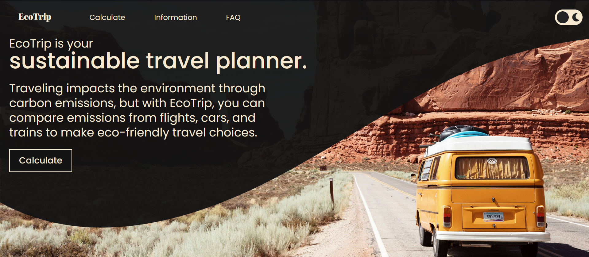
Dark theme

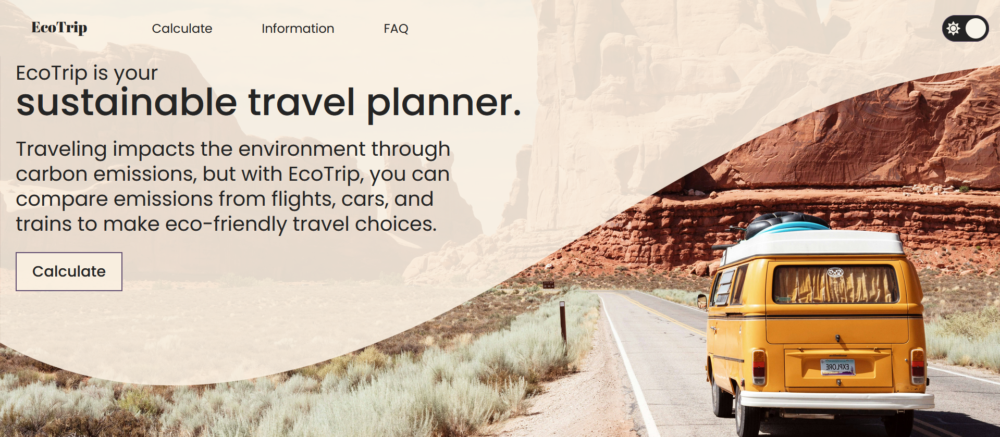
Light theme 

#### Calculate page

Dark theme

Light theme

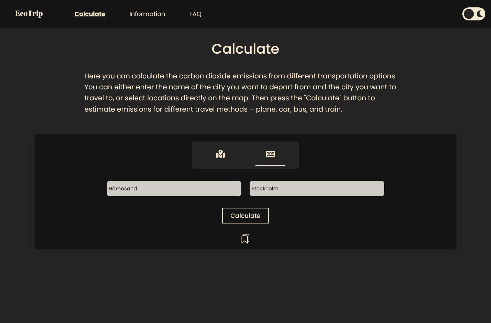
Input option

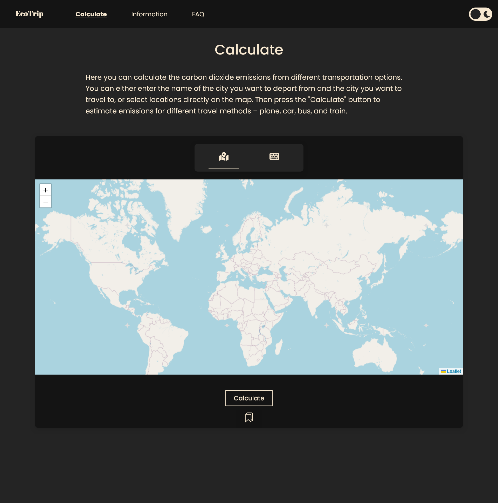
Map option

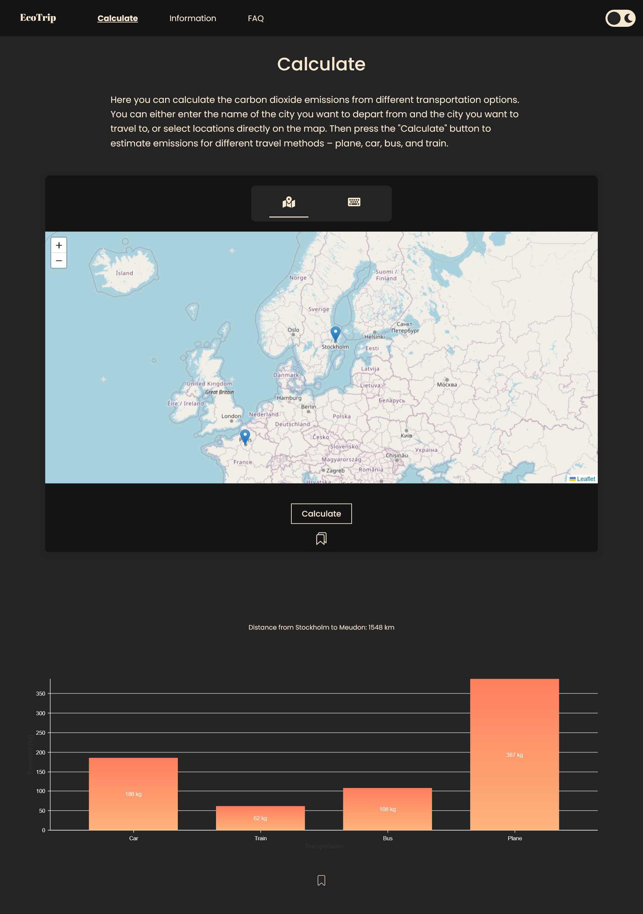
Results

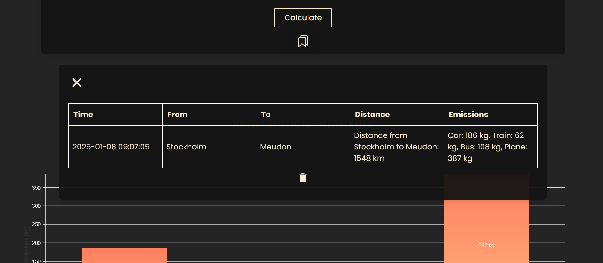
Saved searches

#### Information page

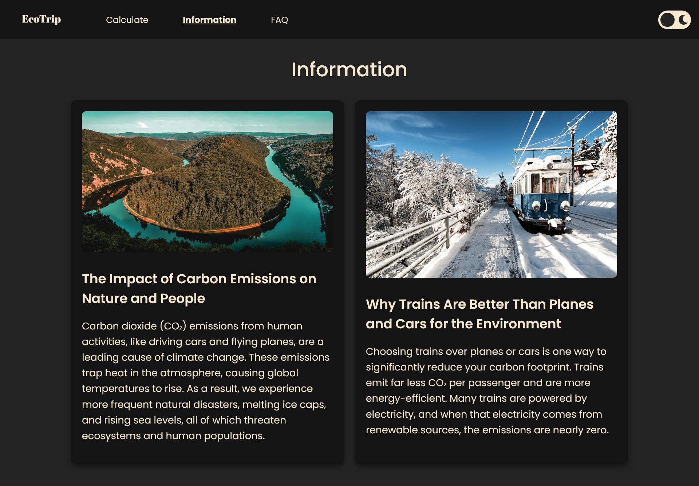
Dark theme

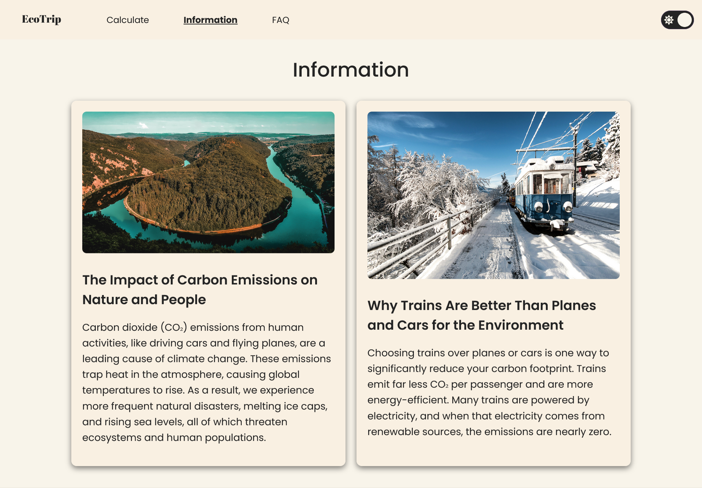
Light theme

#### FAQ page

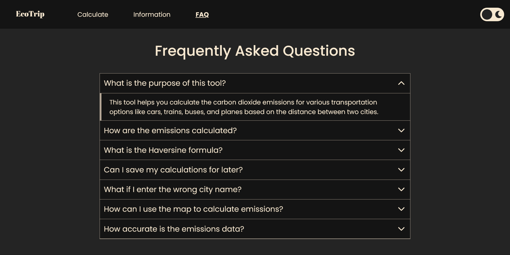

#### Mobile version

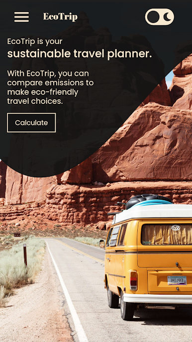

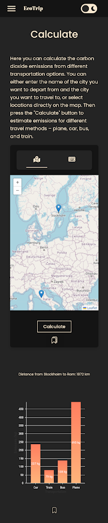

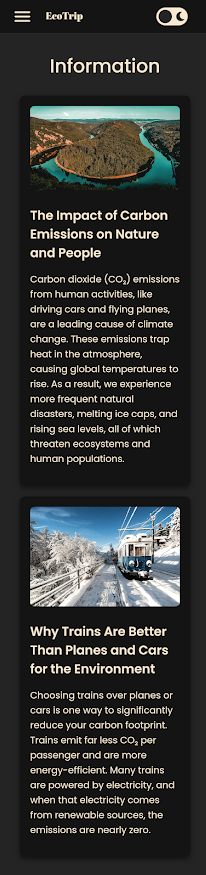

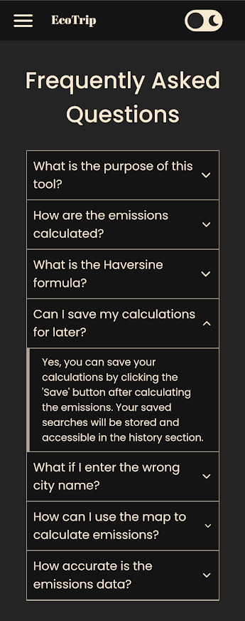

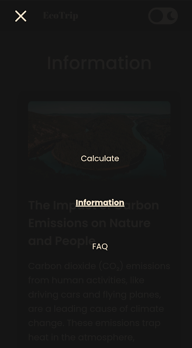
Open menu, dark theme

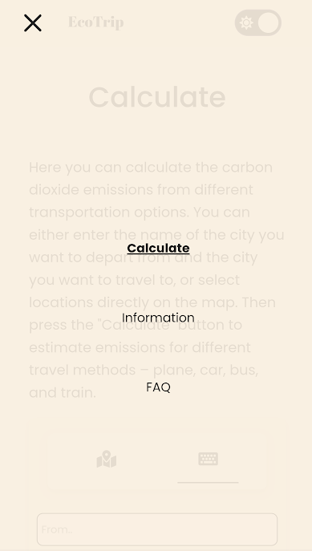
Open menu, light theme

Published: 2025
